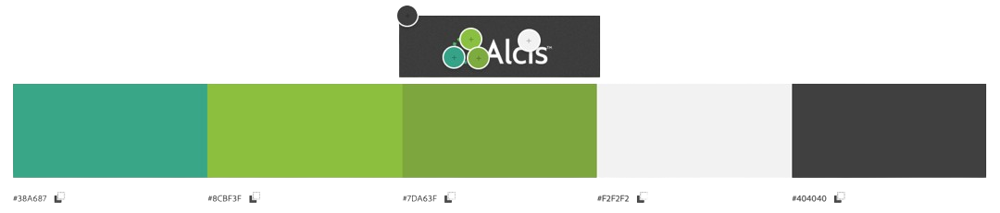

    

---
# [Alcis Geo Connect]()

 

This is a project for [Alcis Geo](https://www.alcis.org/) and aims to provide a centralised location for managing bespoke geospatial portals for Alcis customers. Utilising user logins both for Alcis Staff and their customers, each user of the site will have access to information and services pertinent to them.

The aim is to provide a simple and intuitive, yet interactive geospatial visualisation tool so that customers can get dynamic and interactive depictions of their relevant information wherever they are, and on whatever device they have at hand.

## Key Features:

- **Client-Specific Portals**: Provide each client with a dedicated portal tailored to their specific needs and projects, ensuring personalised access to relevant geospatial data and tools via user accounts.

- **Secure User Authentication**: Implement robust user authentication mechanisms to ensure secure access to client portals and protect sensitive/personal geospatial information.

- **Customisable Client Dashboards**: Enable clients to customise their dashboard views, allowing them to prioritise and access the most relevant data and analysis tools quickly.

- **Enriched Data Visualisation**: Interactive, data specific charts will enable clients to quickly visualise their most important data and make more efficient decisions.

- **Role-Based Access Control**: Implement role-based access control to manage staff access levels and permissions within the Alcis staff management system, ensuring appropriate data security and confidentiality.

- **Content Management System (CMS)**: Provide Alcis staff with a user-friendly CMS for managing and updating client portals, enabling seamless content publishing, data integration, and maintenance.

## Benefits:

- **Enhanced Client Collaboration**: Foster closer collaboration and communication with clients by providing them with dedicated portals for accessing geospatial data and collaborating with Alcis staff.

- **Increased Transparency**: Enhance transparency and accountability by providing clients with visibility into project progress, data updates, and analysis results through their dedicated portals.

- **Client Satisfaction**: Boost client satisfaction and loyalty by delivering a personalised and interactive user experience through the client portals, tailored to their specific needs and preferences.

---

## Table of Contents
1. [**UX**](#ux)
    - [**User Stories**](#user-stories)
    - [**Design**](#design)
        - [**Color Scheme**](#color-scheme)
        - [**Imagery**](#imagery)
        - [**Typography**](#typography)
    - [**Wireframes**](#wireframes)
    - [**Database Design**](#database-design)

---

## UX

### User Stories

- #### As an Alcis Geo Customer, I want to:

    - View the site irrespective of what device I am using.
    - Log in to a personal user account to create custom views and highlight information I will use often.
    - Be able to view and interact with data provided by Alcis Geo Staff.
    - View interactive charts that depict the most important data relevant to me.
    - See relevant updates to the portal.

- #### As a member of Alcis Geo Staff, I want to:

    - Be able to collaborate with customers and receive feedback/ideas for potential changes
    - Log in to a staff account allowing me to edit, update and change certain features on customer portals.
    - Update layers and link them to portals to ensure the customer has access to the most up-to-date information.

- #### As an Alcis Geo Manager, I want to:

    - Assign staff members to specific tasks, or provide access to manage certain portals.
    - Create and update customer user accounts.
    - Manage Staff user accounts.
    - See a list of recently made changes by Alcis Staff.

### Design

This web application will be in the style of a dashboard, with navigation/menu items on the left, with additional functionality on a smaller top bar.

#### Color Scheme

The colour scheme will be based off of the current Alcis website and it's logo to ensure customers have a familiar experience.

    

*Palette*: **Extracted From Above Image**

| 1 | 2 | 3 | 4 | 5 |
| :---: | :---: | :---: | :---: | :---: |
|  |  |  |  |  |
| #38A687 | #8CBF3F | #7DA63F | #F2F2F2 | #404040 |

The above table was extracted from the image using [Adobe Color](https://color.adobe.com/create/image) by uploading the image and selecting the colours extracted from the image.

These will be placed as *:root* variables within the style.css file in order to be used across all necessary elements.
