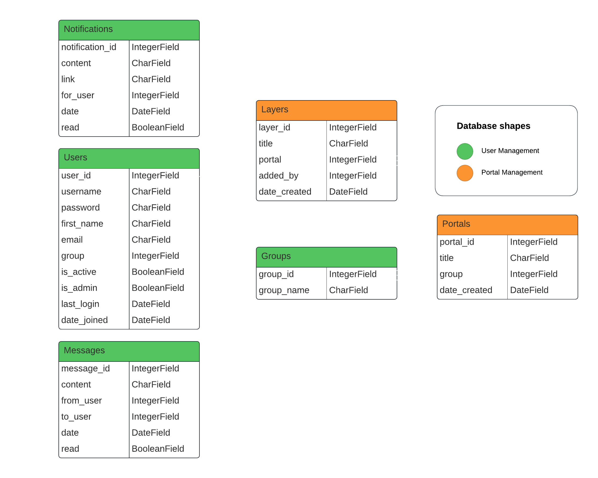

    

---
# [Alcis Geo Connect]()

 

This is a project for [Alcis Geo](https://www.alcis.org/) and aims to provide a centralised location for managing bespoke geospatial portals for Alcis customers. Utilising user logins both for Alcis Staff and their customers, each user of the site will have access to information and services pertinent to them.

The aim is to provide a simple and intuitive, yet interactive geospatial visualisation tool so that customers can get dynamic and interactive depictions of their relevant information wherever they are, and on whatever device they have at hand.

## Key Features:

- **Client-Specific Portals**: Provide each client with a dedicated portal tailored to their specific needs and projects, ensuring personalised access to relevant geospatial data and tools via user accounts.

- **Secure User Authentication**: Implement robust user authentication mechanisms to ensure secure access to client portals and protect sensitive/personal geospatial information.

- **Customisable Client Dashboards**: Enable clients to customise their dashboard views, allowing them to prioritise and access the most relevant data and analysis tools quickly.

- **Enriched Data Visualisation**: Interactive, data specific charts will enable clients to quickly visualise their most important data and make more efficient decisions.

- **Role-Based Access Control**: Implement role-based access control to manage staff access levels and permissions within the Alcis staff management system, ensuring appropriate data security and confidentiality.

- **Content Management System (CMS)**: Provide Alcis staff with a user-friendly CMS for managing and updating client portals, enabling seamless content publishing, data integration, and maintenance.

## Benefits:

- **Enhanced Client Collaboration**: Foster closer collaboration and communication with clients by providing them with dedicated portals for accessing geospatial data and collaborating with Alcis staff.

- **Increased Transparency**: Enhance transparency and accountability by providing clients with visibility into project progress, data updates, and analysis results through their dedicated portals.

- **Client Satisfaction**: Boost client satisfaction and loyalty by delivering a personalised and interactive user experience through the client portals, tailored to their specific needs and preferences.

---

## Table of Contents
1. [**UX**](#ux)
    - [**User Stories**](#user-stories)
    - [**Design**](#design)
        - [**Color Scheme**](#color-scheme)
        - [**Imagery**](#imagery)
        - [**Typography**](#typography)
    - [**Wireframes**](#wireframes)
    - [**Database Design**](#database-design)
2. [**Features**](#features)
    - [**Existing Features**](#existing-features)
    - [**Planned Features**](#planned-features)
3. [**Technologies Used**](#technologies-used)
    - [**Development Technologies**](#development-technologies)
    - [**Front-End Technologies**](#front-end-technologies)
    - [**Back-End Technologies**](#back-end-technologies)

---

## UX

### User Stories

- #### As an Alcis Geo Customer, I want to:

    - View the site irrespective of what device I am using.
    - Log in to a personal user account to create custom views and highlight information I will use often.
    - Be able to view and interact with data provided by Alcis Geo Staff.
    - View interactive charts that depict the most important data relevant to me.
    - See relevant updates to the portal.

- #### As a member of Alcis Geo Staff, I want to:

    - Be able to collaborate with customers and receive feedback/ideas for potential changes
    - Log in to a staff account allowing me to edit, update and change certain features on customer portals.
    - Update layers and link them to portals to ensure the customer has access to the most up-to-date information.

- #### As an Alcis Geo Manager, I want to:

    - Assign staff members to specific tasks, or provide access to manage certain portals.
    - Create and update customer user accounts.
    - Manage Staff user accounts.
    - See a list of recently made changes by Alcis Staff.

### Design

This web application will be in the style of a dashboard, with navigation/menu items on the left, with additional functionality on a smaller top bar.

#### Color Scheme

The colour scheme will be based off of the current Alcis website and it's logo to ensure customers have a familiar experience.

    

*Palette*: **Extracted From Above Image**

| 1 | 2 | 3 | 4 | 5 |
| :---: | :---: | :---: | :---: | :---: |
|  |  |  |  |  |
| #38A687 | #8CBF3F | #7DA63F | #F2F2F2 | #404040 |

The above table was extracted from the image using [Adobe Color](https://color.adobe.com/create/image) by uploading the image and selecting the colours extracted from the image.

These will be placed as *:root* variables within the style.css file in order to be used across all necessary elements.

#### Imagery

Any imagery used on the website will be from Alcis products and those created by Alcis Geo.

#### Typography

The main font that will be applied to the web application is [Montserrat](https://fonts.google.com/specimen/Montserrat), with a fallback font of **Sans-Serif**.

### Wireframes

The below wireframes will help understand the basic design and layout of information on each page.

CLICK HERE to view desktop wireframes

#### Dashboard, User not signed in

#### Dashboard, Customer signed in

#### Dashboard, Admin signed in

#### Portal, Customer signed in

CLICK HERE to view mobile wireframe

#### Dashboard, User not signed in

### Database Design

Below is the schema design for the database that will hold and handle user accounts, groups, portals and layers alongside user specific features such as notifications and/or messages.

This is a relational database handled by [PostgreSQL](https://www.postgresql.org/) which uses primary and foreign keys from each table in order to relate entries to eachother.

This database design will ensure that users can only access their specified portals, and information relative to their groups.

This database design is subject to change if other features are required.

## Features

In lieu with the project requirements, I will list and update the features that are currently, or will be available on the site.

### Existing Features

No existing features are present as development has not begun.

### Planned Features

- **User Accounts** - Clients, Alcis Staff and Alcis Management will have individual, secure accounts that will allow them to access specific features on the site based on their user requirements

- **User Management** - Alcis Management Staff will have access to account and group creation in order to assign Staff to manage specific portals, and create accounts for customers to access their group portals.

- **Portal Management System** - Users aligned to specific portals with management authorisation will be able to add, remove and update layers within the specific portals.

- **Portal Viewing** - Clients that are assigned to portals will be able to view and interact with their specific data, with visual popups containing more information such as charts, tables and predictions.

- **Messages** - Users with accounts on the site will have access to messaging areas, where with certain restrictions they are able to send messages to people within their groups or ask questions to Alcis staff.

- **Notifications** - Portal Managers will be able to issue a notification to customers assigned to portals in order to notify them of updates or changes made to their portals or user accounts.

More features will be added during the development process.

## Technologies Used

In this section I will highlight the development technologies, from software to individual programming languages and packages.

### Development Technologies

- 
    - [Balsamiq](https://balsamiq.com/) - Balsamiq was used in order to create intuitive wireframes during the initial design process.
- 
    - [GitHub](https://github.com/) - GitHub was used to store and manage the project within a combined online repository.
- 
    - [VS Code](https://code.visualstudio.com/) - Visual Studio Code will be used as the primary development environment for the project.

### Front-End Technologies

- 
    - [HTML5](https://developer.mozilla.org/en-US/docs/Web/Guide/HTML/HTML5) - HTML5 was used as the primary markup language in order to structure and display the elements on the page.
- 
    - [CSS3](https://developer.mozilla.org/en-US/docs/Web/CSS/CSS3) - CSS Was used in order to provide styling to the web pages with custom colours and sizes of elements.
- 
    - [Bootstrap 4.3.1](https://getbootstrap.com/docs/4.3/getting-started/introduction/) - Bootstrap was used to quickly design and create the layout and look of the website.
- 
    - [jQuery 3.3.1](https://code.jquery.com/jquery/) - jQuery was used in conjunction with bootstrap to apply javascript selectors and updating elements more efficiently.

### Back-End Technologies

- 
    - [Python 3.11.2](https://www.python.org/) - Python will be used as the back-end management language to pass and handle data to and from the application.
- 
    - [Django 3.2](https://docs.djangoproject.com/en/3.2/) - Django will be used as the back-end framework. It boasts great security features and allows each feature to be built and maintained individually.
- 
    - [PostgreSQL 16.1](https://www.postgresql.org/) - PostgreSQL will be used as the database in this project in order to store information regarding users, posts and the attributed data to them.